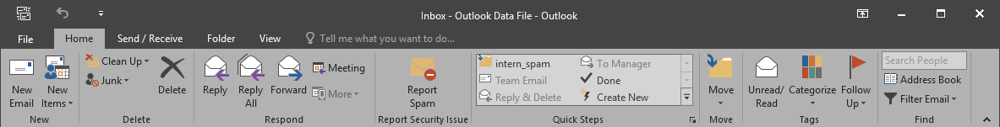

# Outlook Spam Add-In

This Add-In was developed by milCERT.ch, the Swiss Military CERT. The goal of this project is to ease the reporting of suspicious emails by your users, and to reduce the response time between submission and analysis for your security team.

An assessment is performed on every reported email based on the content, headers, attachments, sender, ... and the original email is also included as an attachment for further analysis.
It is fully configurable, easy to deploy, and flexible with the use of registry config and regex that allow you to modify it on the fly without having to recompile and redeploy a newer version.

It currently supports Office 2010, 2013, 2016 and 2019 in both x86 and x64 and is available in English, French, German, and Italian. The user locale is automatically detected at startup.

# Features

A user is able to report one or more emails at a time, either by clicking on the ribbon button, or by using the context menu after selecting the desired items. Here is an overview of some of the implemented features:

- Detect and categorise attachments
- Count http(s) links
- Handle multiples mails at once
- Handle encryption/signatures
- Sender detection
- WinEventLog logging
- Include reported email as attachment
- Prioritization of emails
- Blacklisted attachment extensions
- Extract newsletter unsubscribe link
- ...

# Priorities

The priorities are set according to the following checks. Usually a phishing email only contains a few links in opposition to a newsletter/advertisement email which contains a lot.
If the List-Unsubscribe field is present in the headers, the priority is set to low and the email is handled as a newsletter/advertisement. At this point the security team can unsubscribe the user or give him a feedback.
The email is also prioritized differently if the sender domain is part of your country TLD, as you may have more possibilities for action.

|                                    | **Low** | **Medium** | **High** |
|:-----------------------------------|:-------:|:----------:|:--------:|
| w/o links and attachments          |    X    |            |          |
| Newsletter detected                |    X    |            |          |
| > 3 links                          |         |      X     |          |
| Attachment (.png, .css, .jpg, ...) |         |      X     |          |
| Signed email                       |         |            |     X    |
| Attachment (doc, exe, ps, js, ...) |         |            |     X    |
| Swiss sender domain (.ch, .li)     |         |            |     X    |

# Configuration

The configuration is done once per computer with a few entries into the registry. A sample configuration file is provided. You must change the delivery address To, CC, chose if you want to filter emails coming from within you own organisation and if so provide a regex to match them.
The reported email will be delivered to the *To* address, and may also be delivered to the *CC* address depending on the Spam score. If you don't want to use an additional address, set this field to en empty string *""*.
Note that you can add use multiple addresses in both fields separated by a semicolon.

	Windows Registry Editor Version 5.00

	[HKEY_LOCAL_MACHINE\SOFTWARE\OutlookSpamAddin]
	"To"="milCERT@domain.ch"
	"Cc"="spam@domain.ch"
	"FilterInternalMessages"=dword:00000001
	"Regex"="(^/O=INTERNDOMAIN/OU=EXCHANGE|(@domain\\.ch$|@.*\\.domain\\.ch$))"

You may also want to change your country TLD(s) or other domains to monitor with a higher priority. To do so, modify the regex in the *Ribbon.vb* file. This value is currently hardcoded because it shouldn't change too often.

Starting from Office 2013, Microsoft per default disable Add-Ins that stats in more than 1 second. The system computes the average loading time during the previous 5 startups, anddisable the Add-In if it's more than that.
This threshold may be too short depending on your system, if you have multiples Add-Ins, etc... Please note that the first Add-In which starts is also responsible to loads the *.NET Framework*, and this may impact your loading time even if you're doing nothing at startup.
There are two ways to configure this feature.

The best way to do it is to configure a Computer GPO enabling the Add-In.

- Set the list of managed add-ins GPO [ListOfManagedAddins](https://getadmx.com/?Category=Office2016&Policy=visio16.Office.Microsoft.Policies.Windows::L_ListOfManagedAddins)
	- Value name: "milCERT Spam Plug-In" (without quotes)
	- Value: "1" (without quotes)

A quick fix if you can't or won't do it by group policy is to add a registry key in the HKCU registry hive. Note that this has to be done once per user, and he has the permission to change it. A sample reg file is also provided.

	Windows Registry Editor Version 5.00

	[HKEY_CURRENT_USER\SOFTWARE\Microsoft\Office\16.0\Outlook\Resiliency\DoNotDisableAddinList]
	"milCERT Spam Plug-In"=dword:00000001
	
Current version is compiled and tested with Visual Studio 2017 and .NET framework 4.7.2 for Windows 10 and Outlook 2016.

# Code Signing

You can specify the Code Signing Certificate you want to use in the *Signing* section of the project properties. This certificate will be used to sign both the *.dll Manifiest* and the *VSTO Deployment Manifest*.
In addition, you can specify a post-build event command line to be able to sign the compiled binary file. Please note that in order to use *signtool* you must use an absolute path or the location has to be present in the search path.

- Project Properties -> Compile -> Build Events... -> Post-build event command line:
	- signtool.exe sign /fd SHA256 /v /a /tr http://tsa.pki.admin.ch/tsa "$(TargetPath)"
- Setup Properties -> PostBuildEvent:
	- signtool.exe sign /fd SHA256 /v /a /tr http://tsa.pki.admin.ch/tsa "$(BuiltOuputPath)"

Feel free to modify the arguments and timestamp url to suit your needs.